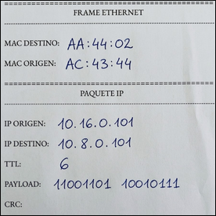
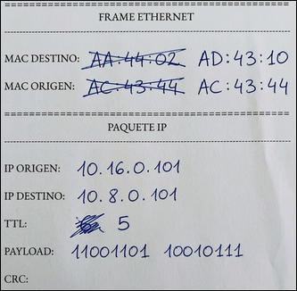

# Redes de Computadoras - Trabajo Práctico 1

### Grupo: Error de Capa 8

### Profesores:

- Facundo O. Cuneo

- Santiago M. Henn

### Integrantes

- Facundo Emanuel Avila Diaz Moreno

- Facundo Esteban Guerrero Pozzi

- Ignacio Joaquin Vigezzi

# Parte 1 - Simulación de Red y envío de paquetes.

## Introducción

La experiencia fue un ejercicio de simulación de red mediante un juego de roles, para comprender mejor el tráfico de paquetes, nos dividimos en grupos de tres o cuatro personas, asumiendo distintos roles dentro de la arquitectura de la red. Cada integrante recibío un papel el cual simularía el paquete a enviar.

## 1. Identificación de dispositivos y armado de la topología.

Cada grupo fue un nodo lógico, operando bajo una topología física en estrella en el núcleo de la red:

- **Los Hosts y Gateways:** En cada grupo, casi todos hacían de equipos hosts, menos un integrante que tomaba el rol de Default Gateway (la puerta de enlace de ese grupo).
- **Los Routers:** Había tres grupos que funcionaban exclusivamente como routers. Estaban conectados entre sí usando una topología en estrella y, a su vez, cada router tenía conectados varios Default Gateways (de los otros grupos de los hosts).

En el caso de este grupo, funcionamos como hosts de la red, teniendo un alumno que actuó como Router/Gateway predeterminado, y otro que actuó como host.
El gateway predeterminado se encarga de ser la puerta de salida de los paquetes que se desean enviar fuera de la red. Además, cuando se reciben paquetes de otra red, estos llegan al gateway predeterminado, antes de decidir a qué host de la red local enviar, o si se deben enviar a otra red externa.

### NIC de los dispositivos de la red:

| Rol             | Dirección IP | Dirección MAC | Máscara de subred | Gateway por defecto |
| --------------- | ------------ | ------------- | ----------------- | ------------------- |
| Host            | 10.16.0.101  | AC:43:44      | 255.255           | 10.16.0.105         |
| Default gateway | 10.16.0.105  | AA:44:02      | 255.255           |                     |

El host de destino debía transmitir a la dirección IP 10.8.0.101, el siguiente payload: cd97 (1100110110010111 en binario)


Como se puede apreciar en la imagen, cada red LAN es conformada por una topología estrella, ya que todos los hosts se conectan a un nodo central, el default gateway, el cual gestiona el tráfico. Es la topología más común en redes LAN modernas por su alta confiabilidad: Si falla un cable, solo ese nodo pierde conexión, sin afectar al resto

## 2. Mecánica de Transmisión: (El proceso Hop-by-Hop)

Cada host partía conociendo información propia a partir de una tabla de datos, como eran su dirección MAC, su IP de origen, una IP de destino y un payload (la carga útil, que era un valor hexadecimal de 16 bits). Con eso podía comenzar el proceso de transmisión.

**1. Del Host al Gateway:** El host armaba el mensaje (el papel). Se anotaba el payload, la IP de origen y la de destino. Ponía su propia MAC como origen y la MAC de su Default Gateway como destino, ponía el TTL (time to live) en 6 y entregaba el “paquete” (papel) a su gateway. En nuestro caso como eramos hosts, así fue como quedó uno de nuestros paquetes a enviar:



**2. El salto en el Gateway:** Una vez que el Gateway recibía el papel, preparaba el paquete para el siguiente salto (hop). Mantenía las IPs intactas, pero debía cambiar las direcciones físicas MAC poniendo ahora la suya como MAC de origen y la del Router como MAC de destino y restando el TTL en uno. Quedando por ejemplo:



**3. La decisión del Router:** Una vez que al router conectado a nuestro Gateway le llegaba el papel, debía fijarse en la IP de destino para ver a qué subred correspondía, esto lo hacía verificando el prefijo de la IP, donde había dos posibilidades:

- **La IP de destino era de sus equipos locales:** Actualizaba las MACs (su MAC como origen y la del Gateway final como destino) y entregaba el mensaje, restando el TTL en 1. Posteriormente el Gateway de ese grupo la entregaba al host con la IP de destino originalmente modificado por última vez las direcciones MAC, restando también el TTL en uno.
- **La IP de destino era de otra red (no pertenecían a los grupos conectados a él):** Le debía entregar el paquete a otro router a través de la topología en estrella. Para hacer esto, volvía a cambiar las MACs (origen = este router, destino = el próximo router) y restando el TTL en 1. El nuevo router que recibía el paquete, repetía el ciclo hasta que el paquete llegaba al grupo correcto.

Vemos como el TTL se va restando en 1 en cada salto, esto permite evitar que el paquete quede indefinidamente circulando por la red, ya que al llegar a 0 el paquete se descarta.
Algo que ocurrió en la experiencia, fue que había algunas IPs destino que no pertenecían a ninguno de los hosts conectados, por lo que se pudo ver que el paquete iba saltando de router en router, hasta que finalmente era descartado ya que su TTL llegaba a 0.

### Conclusiones

Este trabajo práctico nos sirvió mucho para poder visualizar de forma tangible como funciona la transmisión de paquetes. Pudimos ver claro el proceso hop by hop y diferencias clave como:

- **IP vs. MAC:** Quedó claro que las direcciones IP son inmutables durante el viaje (marcan el origen y destino final), mientras que las direcciones MAC van cambiando en cada salto físico (hop-by-hop) para que el paquete pueda avanzar.
- **Topología en estrella:** Vimos de primera mano lo eficiente que es esta estructura para centralizar el tráfico y repartirlo a las redes correspondientes.

## Parte 2. Inyección y detección de errores.

Para esta actividad se dividió el aula en dos grupos, tanto emisores como receptores. Cada uno tenía una técnica de EDAC distinta.

EDAC (Error Detection and Correction) hace referencia a un conjunto de técnicas utilizadas para detectar y, en algunos casos, corregir errores en datos transmitidos o almacenados. Estos errores pueden producirse debido a ruido en el canal, fallas de hardware u otras interferencias durante la transmisión.

---

### Objetivo en el laboratorio

El ejercicio consiste en simular un entorno donde:

- **Routers**: modifican intencionalmente uno o más bits del _payload_ de los paquetes.
- **Hosts (dispositivos finales)**:
  - Al enviar: aplican una técnica de EDAC.
  - Al recibir: verifican si el paquete fue modificado.

En el caso del grupo, al enviar se tuvo que aplicar la técnica de paridad por nibble, mientras que en la recepción se tuvo que aplicar la técnica del XOR por nibble.

### Paridad por nibble:

Teniendo el payload de 16 bits, se divide en 4 nibbles. Al enviar datos, se calcula el paridad de cada nibble del payload.

- Si la cantidad de unos en ese nibble es par, entonces es paridad 0 (se pone un 0)

- Si la cantidad de unos en ese nibble es impar, entonces es paridad 1 (se pone un 1)

Una vez obtenido el nibble con esta técnica, se envía junto al paquete para que el receptor pueda verificar la integridad del payload enviado.

### XOR por nibble:

Al recibir los datos, se calcula el XOR por nibble, dividiendo el payload en 4 nibbles, y aplicándoles XOR cuatro veces de manera sucesiva, se obtiene un único nibble, el cual es recibido junto al payload, funcionando como un checksum, para verificar la integridad de los datos recibidos.

---

## Paquetes

### Paquete enviado

- Dirección IP de origen: 10.16.0.1

- DIrección IP de destino: Desconocida (repartidos por el profesor)

- Payload: 5dce (0101 1101 1100 1110)

- Checksum: 9 (0101)

El checksum se calculó con la técnica de paridad por nibble, de la siguiente manera:

```
0101 1101 1100 1110

0101 -> 2 bits en uno, es par, por lo tanto = 0
1101 -> 3 bits en uno, es impar, por lo tanto = 1
1100 -> 2 bits en uno, es par, por lo tanto = 0
1110 -> 3 bits en uno, es impar, por lo tanto = 1

Checksum: 0101
```

De esta forma se envía el payload original junto al checksum 0101, para que el receptor verifique la integridad del paquete, que no haya sido modificado en el camino.

### Paquete recibido

- Dirección IP de origen: 10.1.1.2

- Dirección IP de destino: 10.16.0.1

- Payload: eeef (1110111011101111)

- Checksum: 0

Teniendo estos datos, se comprueba la integridad del paquete recibido mediante la técnica del XOR por nibble a continuación:

```
Paquete: 1110 1110 1110 1111
XOR por nibble:
1110 ⊕ 1110 = 0000
0000 ⊕ 1110 = 1110
1110 ⊕ 1111 = 0001
Resultado: 0001 (1)
```

Como se puede verificar, se obtiene un 1 al aplicarle el XOR por nibble al paquete recibido, lo cual difiere del checksum obtenido, el cual es igual a 0, lo que verifica que el paquete fue modificado en la transmisión.
Una característica que tiene la técnica del XOR es que, sabiendo que hubo un error en la transmisión por la discrepancia con el checksum, se puede obtener un conjunto finito de paquetes correctos. Esto es debido a que la operación es XOR, se pueden cambiar los valores de los bits para obtener
Debido a que se sabe que el checksum es 0, se quiere obtener ese mismo valor al realizar las tres operaciones XOR.

Se encontraron dos valores de payload que, al aplicarles la operación de XOR por nibble, se obtiene efectivamente el checksum correcto:

- 1110 1110 1110 1110

- 1110 1111 1110 1111

Se comprueba de la siguiente forma:

```
Paquete: 1110 1110 1110 1110
XOR por nibble:
1110 ⊕ 1110 = 0000
0000 ⊕ 1110 = 1110
1110 ⊕ 1110 = 0000
Resultado: 0
```

```
Paquete: 1110 1111 1110 1111
XOR por nibble:
1110 ⊕ 1111 = 0001
0001 ⊕ 1110 = 1111
1111 ⊕ 1111 = 0000
Resultado: 0
```

Se verifica que el paquete sufrió modificaciones en el camino, y que dos payload posibles son 1110111011101110 y 1110111111101111.

## Conclusión

Las técnicas de detección de errores permitieron verificar la integridad de los errores tanto en la emisión como en la recepción, con las operaciones de paridad de nibble y XOR por nibble, respectivamente. Permitieron verificar que el paquete recibido sufrió modificaciones en la transmisión, y se encontraron dos de un conjunto finito de posibles payload transmitidos. Lamentablemente, no se pudo identificar al grupo que recibió los paquetes transmitidos, por lo que por su lado no verificaron errores en la transmisión.

Es importante destacar que las técnicas de EDAC utilizadas en este laboratorio corresponden únicamente a **detección de errores**, y no a corrección. Es decir, permiten identificar que un error ocurrió, pero no permiten reconstruir el contenido original del mensaje.
