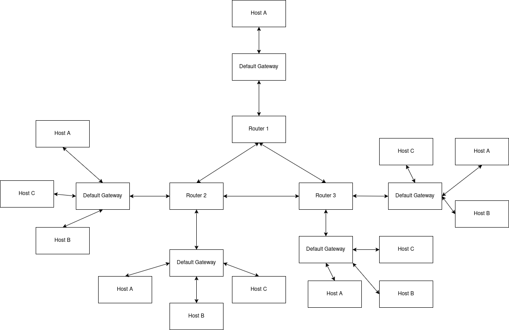

# Redes de Computadoras - Trabajo Práctico 1

### Grupo: Error de Capa 8

### Profesores:

- Facundo O. Cuneo

- Santiago M. Henn

## Integrantes

| Nombre                            | Correo Electrónico              |
| --------------------------------- | ------------------------------- |
| Facundo Emanuel Avila Diaz Moreno | facundo.avila.027@mi.unc.edu.ar |
|                                   |                                 |
|                                   |                                 |

## 1. Identificación de dispositivos y armado de la topología.

En el caso de este grupo, funcionamos como hosts de la red, teniendo un alumno que actuó como Router/Gateway predeterminado, y otro que actuó como host (debido a que un alumno no figuraba en los datos de alumnos, se tuvo un solo host), conformando así la red LAN.
El gateway predeterminado se encarga de ser la puerta de salida de los paquetes que se desean enviar fuera de la red. Además, cuando se reciben paquetes de otra red, estos llegan al gateway predeterminado, antes de decidir a qué host de la red local enviar, o si se deben enviar a otra red externa.

### NIC de los dispositivos de la red:

| Rol             | Dirección IP | Dirección MAC | Máscara de subred | Gateway por defecto |
| --------------- | ------------ | ------------- | ----------------- | ------------------- |
| Host            | 10.16.0.101  | AC:43:44      | 255.255           | 10.16.0.105         |
| Default gateway | 10.16.0.105  | AA:44:02      | 255.255           |                     |

El host de destino debía transmitir a la dirección IP 10.8.0.101, el siguiente payload: cd97 (1100110110010111 en binario)

## 2. Armado de topología

Como se puede apreciar en la imagen, cada red LAN es conformada por una topología estrella, ya que todos los hosts se conectan a un nodo central, el default gateway, el cual gestiona el tráfico. Es la topología más común en redes LAN modernas por su alta confiabilidad: Si falla un cable, solo ese nodo pierde conexión, sin afectar al resto

## Parte 2. Inyección y detección de errores.

Para esta actividad se dividió el aula en dos grupos, tanto emisores como receptores. Cada uno tenía una técnica de EDAC distinta.

EDAC (Error Detection and Correction) hace referencia a un conjunto de técnicas utilizadas para detectar y, en algunos casos, corregir errores en datos transmitidos o almacenados. Estos errores pueden producirse debido a ruido en el canal, fallas de hardware u otras interferencias durante la transmisión.

---

### Objetivo en el laboratorio

El ejercicio consiste en simular un entorno donde:

- **Routers**: modifican intencionalmente uno o más bits del _payload_ de los paquetes.
- **Hosts (dispositivos finales)**:
  - Al enviar: aplican una técnica de EDAC.
  - Al recibir: verifican si el paquete fue modificado.

En el caso del grupo, al enviar se tuvo que aplicar la técnica de paridad por nibble, mientras que en la recepción se tuvo que aplicar la técnica del XOR por nibble.

### Bit de paridad por nibble:

Teniendo el payload de 16 bits, se divide en 4 nibbles. Al enviar datos, se calcula el bit de paridad de cada nibble del payload.

- Si la cantidad de unos en ese nibble es par, entonces es paridad 0 (se pone un 0)

- Si la cantidad de unos en ese nibble es impar, entonces es paridad 1 (se pone un 1)

Una vez obtenido el nibble con esta técnica, se envía junto al paquete para que el receptor pueda verificar la integridad del payload enviado.

### XOR por nibble:

Al recibir los datos, se calcula el XOR por nibble, dividiendo el payload en 4 nibbles, y aplicándoles XOR cuatro veces de manera sucesiva, se obtiene un único nibble, el cual es recibido junto al payload, funcionando como un checksum, para verificar la integridad de los datos recibidos.

---

## Paquetes

### Paquete enviado

- Dirección IP de origen: 10.16.0.1

- DIrección IP de destino: Desconocida (repartidos por el profesor)

- Payload: 5dce (0101110111001110)

- Checksum: 9 (0101)

### Paquete recibido

- Dirección IP de origen: 10.1.1.2

- Dirección IP de destino: 10.16.0.1

- Payload: eeef (1110111011101111)

- Checksum: 0
