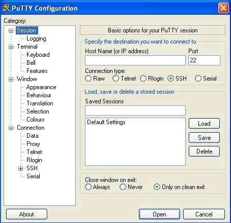
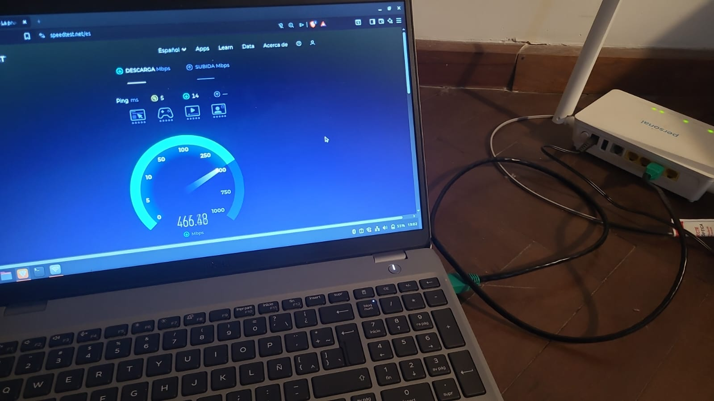

# Redes de Computadoras - Trabajo Práctico 2

### Grupo: Error de Capa 8

### Profesores:

- Facundo O. Cuneo

- Santiago M. Henn

### Integrantes

- Facundo Emanuel Avila Diaz Moreno

- Facundo Esteban Guerrero Pozzi

- Ignacio Joaquin Vigezzi

## Armado y verificación de cables Cat5/Cat5e bajo estándar T568A/B

En este laboratorio utilizamos 1 metro de cable UTP Cat5e y conectores RJ45 para construir un cable de conexión bajo la norma T568A/B en configuración DERECHO, no cruzado.


Prestando especial atención al crimpado de los conectores y utilizando un tester para verificar que cada uno de los 8 conductores de los pares trenzados tenga una conexión adecuada en los extremos.


### Conexión

Para verificar el correcto funcionamiento del cable, utilizamos un switch para conectar 2 computadoras y comunicarnos con otro grupo. Definimos manualmente nuestra IP 192.168.1.1, el otro grupo estableció la dirección 192.168.1.2.


Mediante ping podemos ver que la conexión es exitosa y sin pérdida de paquetes, por lo tanto, el cable funciona correctamente.

---

## Parte 2: Equipamiento físico, verificación y utilización de equipos de red y análisis de tráfico.

En este parte el grupo no pudo conectarse al Switch “Cisco Catalyst 2950 Series”, ya que no contó con el tiempo suficiente. Sin embargo, se pudo conectar al router del aula.

El Switch Cisco Catalyst 2950 Series, según su datasheet, posee las siguientes especificaciones:

### Rendimiento

- 12 puertos 10/100 Mbps
- Ancho de banda de reenvío máximo: 4.8 Gbps.
- Tasa de reenvío: 3.6 Mpps (basada en paquetes de 64 bytes).
- Memoria: 16 MB de DRAM y 8 MB de memoria Flash.
- Búfer de paquetes: 8 MB de arquitectura compartida por todos los puertos.
- Tabla de direcciones MAC: COnfigurable hasta 8000 direcciones.

### Características físicas y eléctricas

- Dimensiones: 4,36 x 44,45 x 24,18 cm. Ocupa 1 RU (unidad de rack).
- Peso: 3 kg
- Consumo de energía: 30W máximo.
- Fuente de alimentación: Interna de rango automático (100 a 240 VAC) y conector para el sistema de alimentación redundante opcional Cisco RPS 675.

### Funcionalidades Destacadas

- Software: Equipados con el software Standard Image (SI), que ofrece funciones básicas de datos, voz y video.

- Seguridad: Soporte para IEEE 802.1x, seguridad de puerto basada en direcciones MAC y SSHv2 para sesiones de administración cifradas.

- Calidad de Servicio (QoS): Soporta cuatro colas de salida por puerto, clasificación basada en 802.1p (CoS) y algoritmos de programación Strict Priority y Weighted Round Robin (WRR).

- Gestión: Administrable vía Web (Cisco Device Manager), SNMP (v1, v2 y v3 no criptográfico) y CLI.

## Indicadores para conectarse al Switch Cisco a través de PUTTY

### Conectar una PC al puerto de consola del switch Cisco a 9600 baudios utilizando PUTTY.

- Abrir el programa PuTTY y seleccionar el tipo de conexión Serial.
- Serial Line: Ingresar el puerto (ejemplo: `COM1` en Windows o `/dev/ttyUSB0` en Linux).
- En Speed (Baudios), escribir `9600`.
- En Data bits: 8
- En Stop bits: 1
- En Parity: None
- Ir a la categoría _Connection_ -> _Serial_.
- Verificar que _Flow Control_ esté en `None`.
- Hacer clic en Open.
- Apretar Enter.



---

### b) Acceder a las opciones de administración del switch y modificar claves de acceso.

1. **Escalar privilegios y entrar al modo de configuración:**
   1. Escribir `enable` para acceder al modo privilegiado.
   2. Escribir `configure terminal` para entrar al modo de configuración global.
2. **Configurar la contraseña del modo privilegiado (Enable):**
   1. Ejecutar el comando `enable secret [clave]`.
3. **Configurar la contraseña para el acceso por Consola:**

```
line console 0
password CLAVE
login
exit
```

4. **Configurar la contraseña para acceso remoto (VTY/Telnet):**

```
line vty 0 4
password CLAVE
login
exit
```

5. **Guardar los cambios de forma permanente:**
   1. Presionar `Ctrl + Z` para volver al modo privilegiado.
   2. Ejecutar `copy running-config startup-config` para salvar la configuración en la NVRAM.

---

### c) Conectar computadoras al switch, configurar una red y testear conectividad.

1. **Conexión física y verificación de LEDs:**
   - Conectar las PCs a los puertos de cobre del switch con los cables UTP armados.
2. **Configuración de direccionamiento IP en las computadoras:**
   1. Acceder a las propiedades de red de cada sistema operativo.
   2. Asignar direcciones en la misma subred (Capa 3):
      1. **PC 1:** IP `192.168.1.10`, Máscara `255.255.255.0`.
      2. **PC 2:** IP `192.168.1.20`, Máscara `255.255.255.0`.
3. **Prueba de conectividad (Capa 3):**
   1. Abrir la terminal o símbolo del sistema en la PC 1.
   2. Ejecutar `ping 192.168.1.20`.
   3. **Diagnóstico:**
      1. Si hay respuesta: La conectividad es exitosa.
      2. Si hay tiempo de espera agotado: Revisar el Firewall de la PC destino o la integridad del cable físico.

---

De a dos o más grupos por switch, conectarán una computadora por cada grupo al mismo utilizando los
cables que tengan de la parte 1 de este TP. Por el amor de todo lo que es bueno espero que hayan verificado
bien el cable. Verificar que pueden llegar a la PC de otro grupo usando ping o captura de paquetes.

### Envío de paquetes a otro host a través del switch

Para el envío de paquetes hasta el host de los otros compañeros, se tuvo que configurar en ambos PCs la dirección IP del host y del gateway de cada uno. Esto se hizo a través de las terminales de cada computador. Una vez configurados, se procedió con el envío a través de un ping con la dirección del otro host. Se verificó que efectivamente todos los paquetes son recibidos.

```
Pinging 169.254.105.10 with 32 bytes of data:
Reply from 169.254.105.10: bytes=32 time=1ms TTL=64
Reply from 169.254.105.10: bytes=32 time=1ms TTL=64
Reply from 169.254.105.10: bytes=32 time=1ms TTL=64
Reply from 169.254.105.10: bytes=32 time=1ms TTL=64

Ping statistics for 169.254.105.10:
    Packets: Sent = 4, Received = 4, Lost = 0 (0% loss),
Approximate round trip times in milli-seconds:
    Minimum = 1ms, Maximum = 1ms, Average = 1ms
```

---

Finalmente, se comprobó el funcionamiento del cable UTP armado en el laboratorio en el hogar de un alumno, con un router configurado correctamente, y con el servidor DHCP funcionando.



Se comprueba que la conexión a internet se estableció correctamente.

## Conclusiones

En este trabajo se pudo trabajar con varias capas del modelo OSI. Primero, con la capa física, armando cables UTP con nuestras propias manos, lo cual fue una muy buena experiencia, porque siempre se trabajó en lo teórico y muy poco en lo práctico, y en este trabajo se trabajó con las capas mas bajas. Luego de dos intentos fallidos, el cable pasó el test, y utilizando el router de TP-LINK, ya que no se tuvo el tiempo suficiente de configurar el switch en clases, se pudieron enviar paquetes hacia la PC de los compañeros.
Durante la etapa de testeo de conectividad hacia el host del compañero, se prescindió de un servidor DHCP, optando por una asignación manual de IPs. Esto permitió tener un control total sobre el direccionamiento de la red local. Al ejecutar exitosamente el comando **ping**, se verificó el ciclo de vida completo de un paquete: la encapsulación de los datos, el direccionamiento lógico en la Capa 3 y la transmisión física a través del medio UTP fabricado durante la práctica, consolidando así los conceptos teóricos del modelo OSI vistos en la materia.
