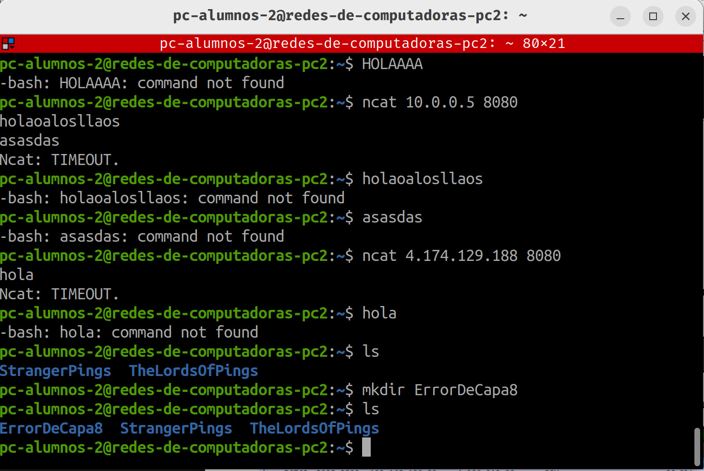
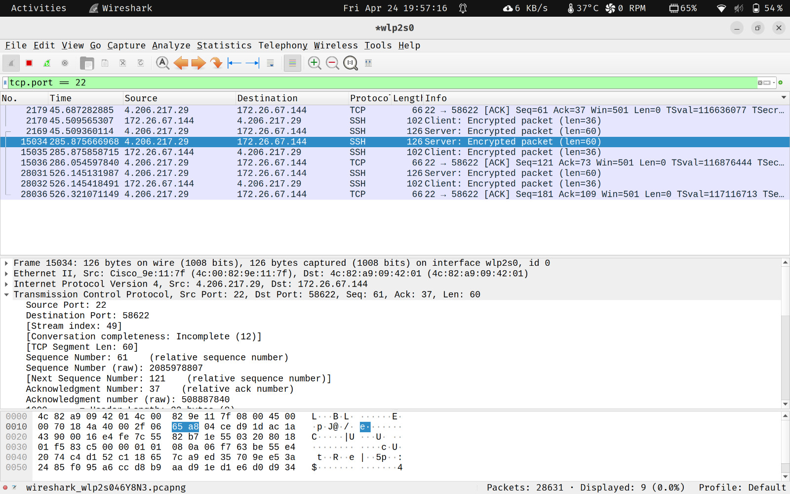
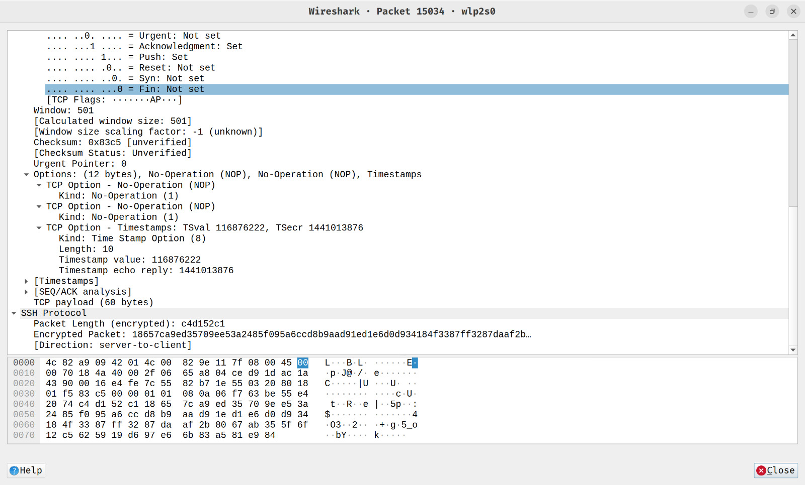
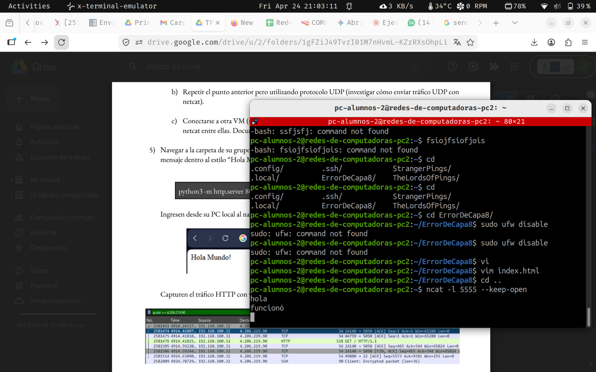
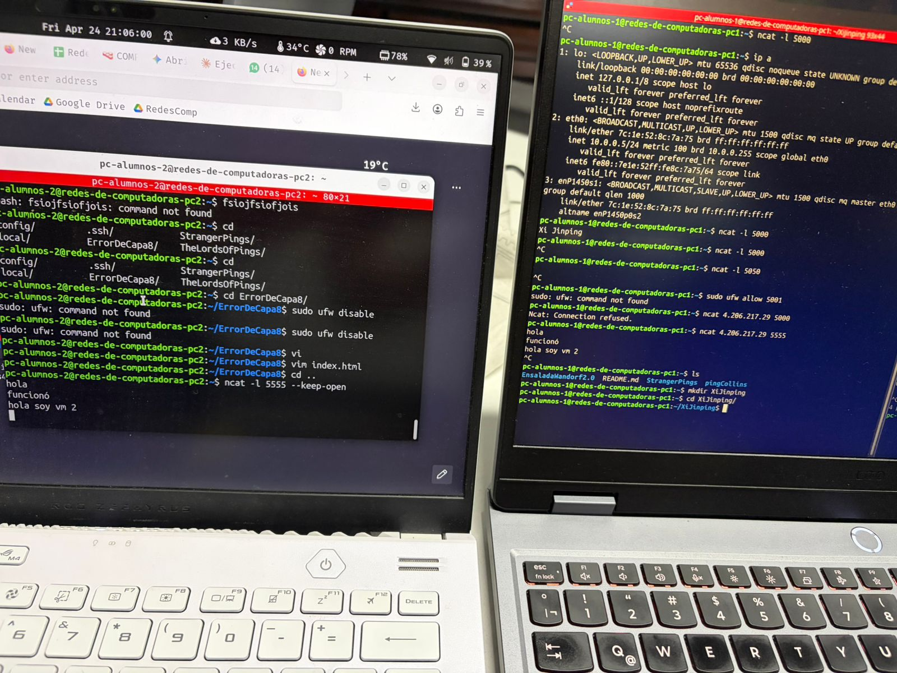
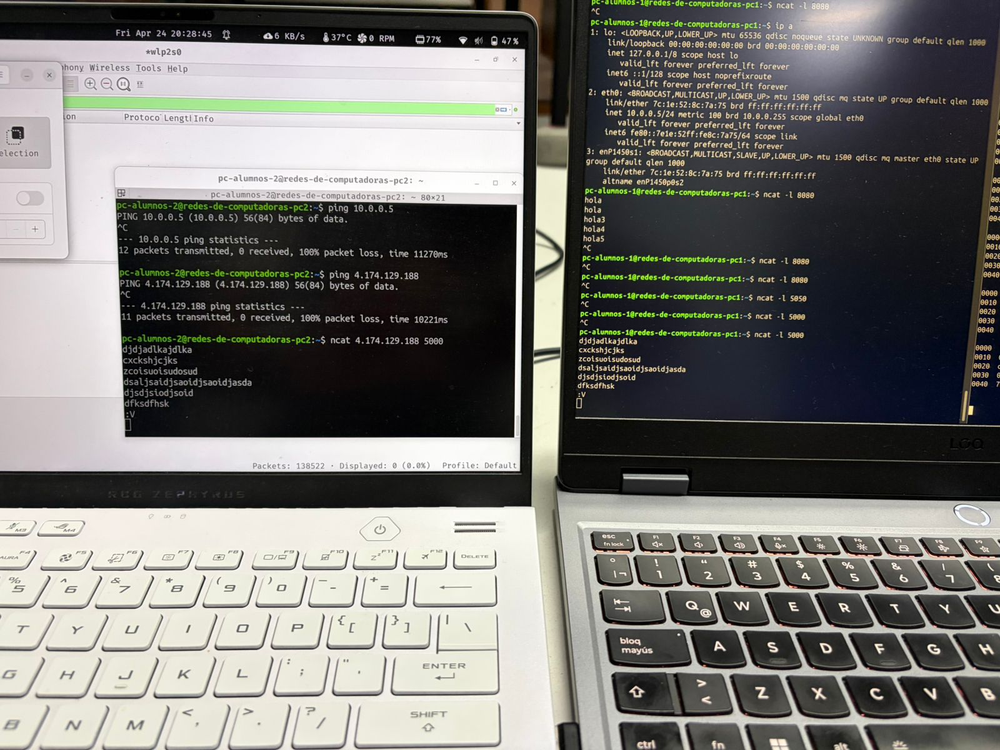

# Redes de Computadoras - Trabajo Práctico 3

### Grupo: Error de Capa 8

### Profesores:

- Facundo O. Cuneo

- Santiago M. Henn

### Integrantes

- Facundo Emanuel Avila Diaz Moreno

- Facundo Esteban Guerrero Pozzi

- Ignacio Joaquin Vigezzi

## 1

## 2 Verificación conexión SSH con alguna de las VMs reservadas

Se utilizaron las PCs 1 y 2. Se conectó a la PC2 a traves de ssh utilizando el siguiente comando en la terminal:

```sh
ssh -i pc2_key.pem pc-alumnos-2@4.206.217.29
```

Finalmente, se creó la carpeta **ErrorDeCapa8** en el directorio home de la VM.



---

### Captura de tráfico SSH con Wireshark

Se utilizó Wireshark para capturar tráfico correspondiente a una sesión SSH. Al inspeccionar los paquetes capturados, se observa que el contenido de la carga útil aparece como datos cifrados (encrypted packet).



Esto es esperable, ya que SSH es un protocolo diseñado específicamente para garantizar la confidencialidad y la integridad de la comunicación. Una vez establecida la conexión y negociadas las claves de sesión mediante criptografía asimétrica, todo el tráfico posterior se cifra utilizando algoritmos simétricos.

Como consecuencia, aunque es posible visualizar metadatos como direcciones IP, puertos, longitud de los paquetes y números de secuencia TCP, no es posible descifrar el contenido de los datos transmitidos (por ejemplo, comandos o respuestas) sin acceso a las claves de cifrado utilizadas en la sesión.

En conclusión, no es posible interpretar el contenido de los paquetes SSH capturados en Wireshark debido a que la información viaja cifrada extremo a extremo, cumpliendo con los objetivos de seguridad del protocolo.



---

### Montaje de un servidor TCP

Para la consigna 4, se trabajó en conjunto con el grupo Xi Jinping Revenge, ya que ambos se encontraban en la facultad al momento de hacer el trabajo.

Utilizando netcat, con el siguiente comando: **netcat l <puerto>** se monta un servidor, utilizando un puerto válido del 5000 al 6000. Se optó por utilizar el puerto 5555



Con este comando, nuestra PC actúa como un servidor, escuchando por el puerto 5555 los mensajes de la PC1.
La PC1 envía los mensajes con el comando **ncat 4.206.217.219 5555**, el cual utiliza la terminal para enviar los mensajes a la PC2, que actúa como servidor. De forma alternativa, se puede utilizar **echo hello world | ncat 4.206.217.219 5555**



---

### Captura de Handshake TCP en Wireshark

---

### Montaje de servidor UDP

---

### Conexión con otra VM mediante netcat, envío de mensajes ida y vuelta

Trabajando nuevamente en conjunto con el grupo **Xi Jinping Revenge**,



## 6

### Relacionar el problema que aborda el video con los TPs 1), 2) y 3). ¿Qué cosas que hemos aprendido se aplican directamente al problema demostrado?

La temática del video tiene mucha relación con lo que venimos viendo en los trabajos prácticos.
Empezando por el trabajo práctico 1, esto se puede relacionar pensando en la parte de control de errores, en el video no especifica puntualmente este apartado pero sí menciona que hay bits de flags, que determinan un comportamiento u otro, y justamente son los que se aprovechan para realizar el ataque, por lo que es importante que no haya fallos en estos mensajes provocados por ej por ruido debido a que un bit flipeado puede dar a un comportamiento totalmente distinto, como tomar una transacción verificada cuando no lo esta por ej.
En cuanto al tp2 no hay mucha relación de esos temas con el video, pero si quizás se podría mencionar que en la capa física, la información en lugar de viajar por un cable de red en este caso viaja por el aire ya que se aprovecha el uso de NFC en este ataque.
Y con el tp3 si se comparten muchos conceptos, en el video se habla sobre cifrado ,
donde dicen que los datos de las transacciones no están cifrados debido a que este protocolo se utiliza con distintos dispositivos de distintas marcas lo cual obligaría a tenerlos actualizados lo que puede ser un poco complicado, esto justamente es lo que deja vulnerable a los datos, pudiendo hacerse el estudio posterior de los bits de flags para poder engañar el sistema, esto se puede relacionar con que antes para al usar otros protocolos para acceder de forma remota a otros dispositivos se enviaban los datos en texto plano como el caso del video, dejando vulnerable la comunicación a diferencia de ahora que como vimos en el tp3 se usa ssh que utiliza cifrado para evitar eso justamente, como pudimos ver cuando quisimos descifrar lo capturado con wireshark.
También cuando habla de criptografía asimétrica, menciona claves privadas y públicas, estos conceptos como vimos en la investigación conceptual de este tp, son fundamentales para el cifrado RSA y la protección de la autenticación de cada persona y por consiguiente el acceso a sus datos.

### ¿Qué cosas deberíamos tener en cuenta dado el principio de confidencialidad en las redes de computadoras y los resultados obtenidos en este laboratorio?

Tomando en cuenta el principio de confidencialidad de las redes y lo que vimos en este tp3, podemos decir que queda bastante claro que no se puede confiar en la red como medio seguro por defecto. Cualquier persona con acceso a la misma red puede capturar el tráfico sin demasiado esfuerzo, y ver todo lo que está circulando. Esto rompe completamente la idea de privacidad si no se toman medidas adicionales.
Acá es donde aparece el problema del texto plano, protocolos como HTTP, Telnet, o incluso Netcat, envían la información sin ningún tipo de protección. En el laboratorio se vio que todo lo que se mandaba podía leerse directamente desde los paquetes capturados. Si en lugar de eso hubiese habido información sensible, también hubiera quedado expuesta sin ninguna barrera.
Por eso es fundamental el uso de protocolos seguros que implementen cifrado. Como vimos con el caso de SSH aunque los paquetes también se pueden capturar, el contenido ya no es legible, porque está cifrado y protegido mediante claves que se negocian durante el inicio de la comunicación.
En consecuencia, a nivel de diseño de sistemas o administración, esto obliga a evitar completamente el uso de protocolos en texto plano cuando hay datos sensibles. Sería recomendable utilizar siempre alternativas seguras, como HTTPS en lugar de HTTP o SSH en lugar de Telnet.
