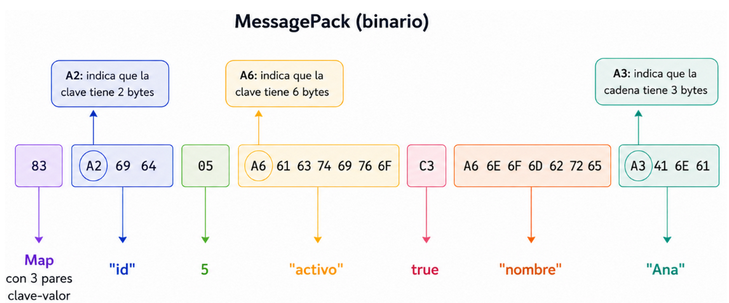
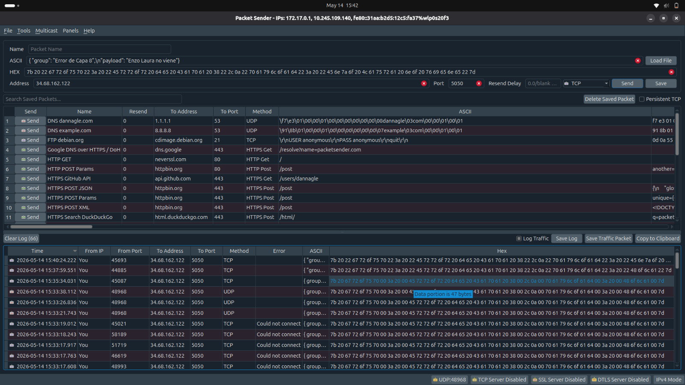
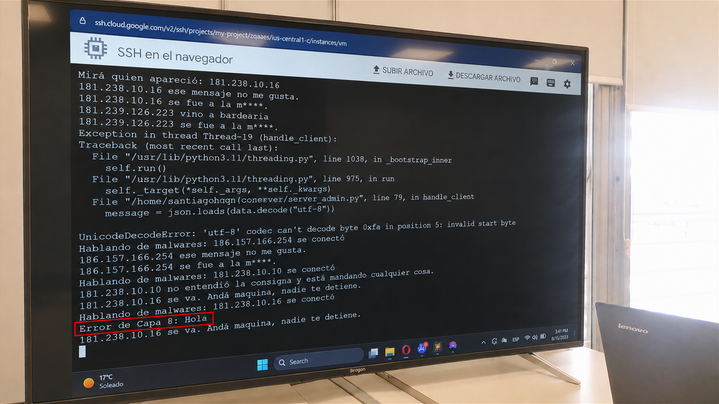
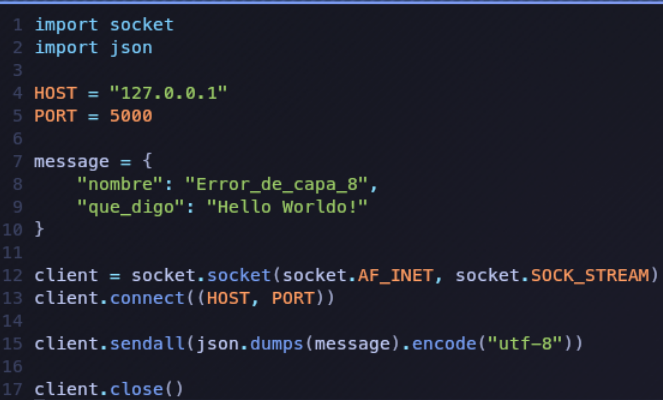
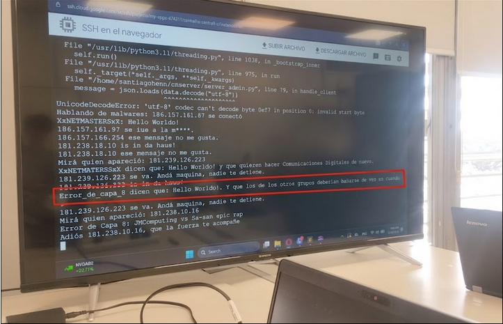
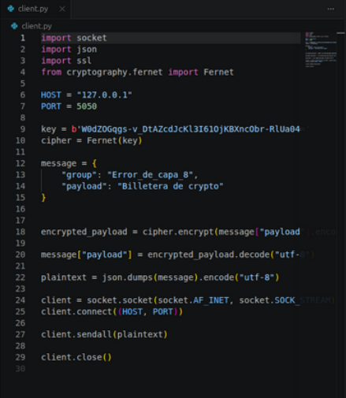
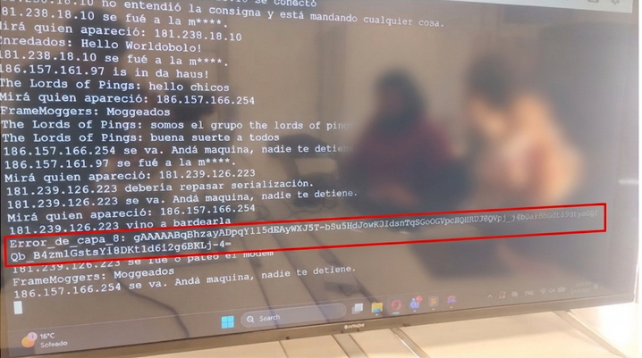
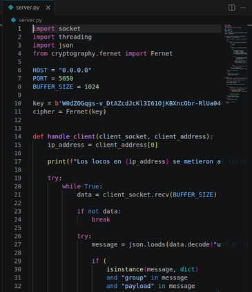
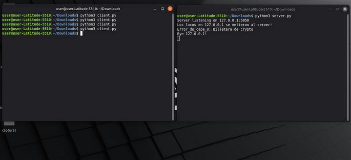

# Trabajo Práctico 4 — Redes de Computadoras

**Universidad Nacional de Córdoba**  
Facultad de Ciencias Exactas, Físicas y Naturales  
Cátedra Práctica Profesional Supervisada

**Grupo:** Error de Capa 8

**Integrantes:**

- Avila Diaz Moreno Facundo Emanuel
- Guerrero Pozzi Facundo Esteban
- Vigezzi Ignacio

---

## 1. Serialización

### a) ¿Qué es la serialización?

La serialización en redes de computadoras es el proceso de convertir objetos o estructuras de datos complejas en una secuencia lineal para poder transmitirlos por la red a otra computadora, donde se realiza el proceso inverso (deserialización).

### b) Serialización Binaria vs No Binaria

La diferencia entre serialización binaria y no binaria radica en el formato de la secuencia lineal en la que se convierte el dato complejo.

#### Serialización Binaria

Los datos se convierten en una cadena de bits, ilegible para el ser humano. La estructura y los tipos de datos se representan mediante patrones de bits con un esquema fijo o prefijado.

**Ventajas:**

- Tamaño reducido
- Alta velocidad de serialización/deserialización
- Soporte nativo de tipos: enteros, floats, booleanos sin ambigüedad
- Ideal para sistemas de alto rendimiento (videojuegos, IoT, microservicios)

**Desventajas:**

- No legible por humanos; imposible inspeccionar con un editor de texto, requiere herramientas especiales para depurar
- Mayor acoplamiento entre emisor y receptor (esquemas fijos)
- Interoperabilidad más compleja entre distintos lenguajes

**Ejemplos:** Protocol Buffers (Protobuf), MessagePack, Apache Avro

---

#### Serialización No Binaria (Textual)

Los datos se codifican como texto plano usando caracteres ASCII o UTF-8. La estructura se representa con marcadores o delimitadores legibles.

**Ventajas:**

- Legible por humanos; fácil de depurar e inspeccionar con Wireshark o el navegador
- Interoperabilidad universal: cualquier lenguaje puede parsear texto
- No requiere esquemas previos
- Ideal para APIs públicas, documentación y configuración

**Desventajas:**

- Mayor tamaño: el número `30` ocupa 2 bytes en texto vs 1 byte en binario
- Más lento de parsear (hay que interpretar caracteres)
- Ambigüedad de tipos: `"30"` (string) vs `30` (número) puede generar errores
- Overhead significativo en sistemas con millones de mensajes por segundo

**Ejemplos:** JSON, XML, YAML, CSV

---

### Ejemplo: mismo dato serializado de ambas formas

El objeto a transmitir:

```
usuario {
  id:     5
  activo: verdadero
  nombre: "Ana"
}
```

#### 1) No Binario — JSON

```json
{ "id": 5, "activo": true, "nombre": "Ana" }
```

Cada parte es texto plano y auto-descriptiva. El receptor lee los nombres de los campos directamente en el mensaje, sin ningún esquema previo.

#### 2) Binario — MessagePack

El mismo objeto serializado produce los siguientes bytes:

```
83 A2 69 64 05 A6 61 63 74 69 76 6F C3 A6 6E 6F 6D 62 72 65 A3 41 6E 61
```



#### Comparación de tamaño

| Formato     | Tamaño   |
| ----------- | -------- |
| JSON        | 36 bytes |
| MessagePack | 24 bytes |

JSON usa alrededor de un **54% más de espacio** para representar exactamente la misma información. En un sistema que procesa millones de mensajes por segundo, esa diferencia es significativa.

---

## 2. Envío de mensajes a servidor TCP mediante Packet Sender

Esta actividad se realizó en el aula, por lo que no se hosteó un servidor local propio; en cambio, se utilizó el proporcionado por el profesor mediante Google Cloud.

Usando el software **Packet Sender**, se accedió al servidor con la dirección IP `34.68.162.122` y el puerto `5050`. El mensaje junto con el payload debió serializarse en formato JSON con la siguiente estructura:


Se tuvo que asegurar que el formato sea **ASCII** para el envío correcto del paquete.



Después de varios intentos fallidos, el paquete llegó correctamente. El servidor recibió el mensaje con el nombre del grupo `"Error de Capa 8"` y el payload `"Hola"`.



Para verificar la conexión correcta desde la salida del servidor, se utilizó [whatsmyipaddress.com](https://whatsmyipaddress.com) para consultar la dirección IPv4 pública, la cual coincide con la mostrada en las capturas.


---

## 3. Envío de mensajes al servidor a través de una aplicación de consola

Se utilizó la aplicación cliente `cliente.py` para enviar mensajes a través de un programa en Python. El mismo utiliza las librerías `socket` y `json` para llevar a cabo la serialización del mensaje a JSON y para la conexión y envío a través de sockets.



El mensaje llegó correctamente. El servidor lo presenta con una cadena adicional al payload enviado.



---

## 4. Envío de mensaje con payload encriptado

Para cifrar el mensaje, se modificó `client.py` para implementar **cifrado simétrico** en Python. Se utilizó el módulo `Fernet` de la librería `cryptography`.

Se dice simétrico porque se utiliza exactamente la misma key para cifrar el mensaje en el cliente y para descifrarlo en el servidor. Por lo tanto, también fue necesario modificar `server.py` para implementar la decodificación con esa key y obtener el payload en texto plano.



### Explicación de las líneas fundamentales

- **Línea 10:** Se crea el objeto `cipher` con la librería y la key.
- **Línea 12:** Se crea un diccionario con los datos.
- **Línea 18:** Se llama al método `encrypt` que toma el texto `"Billetera de crypto"`, lo convierte a bytes y, usando la llave, lo transforma en una cadena incomprensible.
- **Línea 20:** Reemplaza el texto original por el texto encriptado dentro del diccionario.
- **Línea 22:** Convierte ese diccionario en formato JSON para mandarlo por la red.

Así se ve del lado del servidor el mensaje recibido (todavía encriptado).



---

## 5. Desencriptado del payload

Utilizando la misma librería, se modificó `server.py` para desencriptar el payload con la misma llave que se usó en el cliente, implementando así el mecanismo de encriptación simétrica.



### Explicación de las líneas fundamentales

- **Línea 12:** Se crea el objeto `cipher` con la librería y la misma key para poder realizar el proceso inverso (descifrar).
- **Línea 21:** El servidor recibe los datos binarios (bytes) encriptados que viajan por la red desde el cliente a través del socket.
- **Línea 27:** Decodifica los bytes recibidos a texto en formato UTF-8 y convierte la cadena JSON de vuelta a un diccionario de Python.
- **Línea X:** Se desencripta el mensaje usando la función `cipher.decrypt()`.

> **Nota:** Tanto el cliente como el servidor fueron ejecutados de manera local y deben utilizar el mismo valor de key. De lo contrario, el servidor solo verá el mensaje encriptado.

Así se ve del lado del servidor el mensaje desencriptado


