# Trabajo Práctico 5 — Redes de Computadoras

**Universidad Nacional de Córdoba**  
Facultad de Ciencias Exactas, Físicas y Naturales  

**Grupo:** Error de Capa 8

**Integrantes:**

- Avila Diaz Moreno Facundo Emanuel
- Guerrero Pozzi Facundo Esteban
- Vigezzi Ignacio

---

## 1) Reconocimiento de Arquitectura
*Ingresar al juego, observar los componentes disponibles e identificar la función que cumple cada uno respondiendo:*
* **a) Qué problema resuelve?**
* **b) En qué capa o capas del modelo TCP/IP podríamos ubicar su función principal?**
* **c) Qué pasaría si ese componente falta en una arquitectura real?**

### Tabla Comparativa de Componentes

| Componente | a) Qué problema resuelve? | b) Capa del modelo TCP/IP | c) Qué pasaría si falta en una arquitectura real? |
| :--- | :--- | :--- | :--- |
| **Firewall** | Filtra el tráfico de red entrante y saliente basado en reglas de seguridad para proteger la red de accesos no autorizados y ataques. | **Capa de Red e Internet** (si filtra por IPs), **Capa de Transporte** (filtra puertos TCP/UDP) y **Capa de Aplicación** (Analiza contenido, ej peticiones HTTP). | El sistema queda expuesto a paquetes maliciosos, escaneo de puertos, ataques DDoS directos e inyecciones de código malicioso. |
| **Load Balancer** | Distribuye el tráfico entrante de manera inteligente entre múltiples servidores para evitar sobrecargas y garantizar alta disponibilidad. | **Capa de Transporte** (si va según IP/puertos) y **Capa de Aplicación** (según cookies, headers HTTP o URLs para decidir a qué servidor manda el tráfico). | Pérdida de alta disponibilidad. Sistema de distribución no equitativo, se dificulta el escalamiento horizontal. |
| **Queue** | Desacopla componentes y permite comunicación asíncrona. Amortigua picos de tráfico encolando mensajes para que los servidores los procesen a un ritmo parejo. | **Capa de Aplicación** (los protocolos de colas como MQTT operan en esta capa). | Acoplamiento rígido de servicios. Si un servicio destino falla o se satura, no habría donde almacenar temporalmente las peticiones por lo que habría pérdida de peticiones. |
| **Compute** | Provee capacidad de procesamiento y memoria física/virtual para ejecutar sistemas operativos, servidores web y la lógica de negocio de la aplicación. | **Capa de Aplicación** (ejecuta el software de aplicación). | No habría un entorno para ejecutar el código fuente ni procesar lógica, la aplicación no podría existir en un formato de servidor. |
| **Serverless Function** | Permite ejecutar fragmentos de código bajo demanda y basados en eventos sin administrar servidores. Escala a cero y reduce costos operativos. | **Capa de Aplicación** (ejecuta funciones lógicas específicas en respuesta a eventos de aplicación). | Se perdería flexibilidad y se tendrían que pagar servidores dedicados (VMs) de forma continua aunque solo se usen esporádicamente, aumentando los costos de infraestructura. |
| **SQL DB (BD Relacional)** | Almacena datos altamente estructurados garantizando consistencia, integridad referencial y transacciones ACID. | **Capa de Aplicación** (el protocolo del cliente de base de datos corre sobre TCP en la capa de aplicación). | Sería muy complejo manejar datos de transacciones críticas (como compras o cuentas bancarias) sin arriesgarse a inconsistencias y pérdida de integridad. |
| **NoSQL DB (BD No Relacional)** | Almacena datos no estructurados o semiestructurados (como documentos, clave-valor). Permite escalabilidad horizontal sencilla y alta velocidad de escritura/lectura. | **Capa de Aplicación** (las consultas e interacciones con la base de datos son protocolos de aplicación). | Dificultad extrema para escalar la base de datos horizontalmente ante grandes volúmenes de datos dinámicos, y rigidez en el esquema que ralentiza el desarrollo de datos variables. |
| **Cache (e.g., Redis)** | Almacena temporalmente en memoria datos de acceso frecuente para reducir la latencia de respuesta y liberar de carga a la base de datos principal. | **Capa de Aplicación** (el protocolo de comunicación con la caché opera en esta capa). | La base de datos principal se saturaría repitiendo consultas repetidas de lectura, elevando la latencia de los usuarios y pudiendo provocar la caída del sistema por sobrecarga. |
| **CDN (Content Delivery Network)** | Cachea y sirve archivos estáticos (imágenes, CSS, JS, HTML) en servidores distribuidos geográficamente cerca de los usuarios para acelerar la carga. | **Capa de Aplicación** (maneja cacheo HTTP/HTTPS y terminación TLS/SSL en el borde). | Los usuarios lejanos al servidor de origen sufrirían alta latencia de carga. Y estos servidores se saturarían procesando y transfiriendo archivos estáticos redundantes. |
| **Storage** | Almacena archivos y objetos de manera masiva, duradera, económica y accesible mediante APIs web simples (HTTP). | **Capa de Aplicación** (se accede a través de peticiones HTTP/HTTPS). | Los servidores tendrían que guardar archivos localmente en discos rígidos virtuales, lo cual es costoso, no escala indefinidamente y dificulta compartir archivos entre múltiples servidores. |
| **Search Engine** | Permite realizar búsquedas de texto completo, autocompletados y filtros analíticos complejos de manera casi instantánea sobre grandes volúmenes de datos. | **Capa de Aplicación** (provee un motor indexado y expone servicios por API HTTP). | Las funciones de búsqueda en la aplicación (como catálogos o logs) serían extremadamente lentas, ineficientes o inviables usando consultas clásicas de bases de datos. |
| **Réplica** | Distribuye la carga de consultas de lectura entre varias copias de la base de datos principal, dejando principalmente la escritura para la base de datos de datos, mejorando el rendimiento y aportando tolerancia a fallos. | **Capa de Aplicación** (la replicación ocurre a nivel del motor de base de datos). | Se concentraría todo el tráfico de lectura y escritura en el servidor principal de base de datos, volviéndose un cuello de botella y un punto único de fallo absoluto. |

---

## 2) Tipos de Tráfico
*El simulador trabaja con distintos tipos de solicitudes: STATIC, READ, WRITE, UPLOAD, SEARCH, MALICIOUS. Completar la tabla con ejemplos, componentes y riesgos.*

### Clasificación y Manejo de Tráfico

| Tipo de Tráfico | Ejemplo Real | Componente Recomendado | Riesgo si se procesa incorrectamente |
| :--- | :--- | :--- | :--- |
| **STATIC** *(Verde)* | archivos HTML, CSS, scripts de JavaScript o el logo de la página (png o jpg). | **CDN (Content Delivery Network)** en combinación con **Storage**. | **Saturación del backend y lentitud**: El servidor principal y las bases de datos se saturarían entregando archivos pesados y repetitivos, degradando el rendimiento de todo el sitio |
| **READ** *(Azul)* | Consultar el perfil de un usuario, cargar la lista de productos de una tienda online, o leer posts. | **Caché** para datos muy frecuentes y **Réplicas** de la base de datos SQL/NoSQL. | **Caída de la Base de Datos**: Si todas esas lecturas van directo a la base de datos principal colapsaría por exceso de consultas. |
| **WRITE** *(Naranja)* | Registrar un nuevo usuario, realizar una compra (crear orden de pago), o publicar un comentario en una red social. | **SQL DB** (para consistencia transaccional) o **NoSQL DB** (para volumen masivo de escrituras rápidas). También **Queue** para encolar escrituras y procesarlas asincrónicamente. | **Inconsistencia y pérdida de datos**: Se perderían transacciones importantes (como pagos o registros). Sin transacciones ACID adecuadas, pueden ocurrir duplicaciones o corrupción de datos críticos. |
| **UPLOAD** *(Amarillo)* | Subir una foto de perfil nueva, adjuntar un archivo PDF o subir un video. | **Storage** | **Llenado del disco duro del servidor**: Si los archivos pesados se guardan localmente en la máquina virtual en vez de un Storage externo, el disco se llenaría por completo, provocando la caída catastrófica del sistema operativo y del servidor. |
| **SEARCH** *(Celeste)* | Buscar productos usando una barra de búsqueda con filtros ("zapatillas rojas talle 41"), o buscar un término específico en un foro. | **Search Engine** (Motor de búsqueda) | **Consultas muy lentas**: Hacer búsquedas complejas de texto usando consultas SQL clásicas (LIKE '%...%') consumiría toda la CPU de la base de datos, ralentizando o colgando el servidor para todos los usuarios. |
| **MALICIOUS** *(Rojo)* | Un ataque de denegación de servicio (DDoS), escaneo automatizado de puertos buscando vulnerabilidades, o spam de peticiones repetitivas desde una botnet. | **Firewall** para bloquear o descartar las peticiones inmediatamente antes de que toquen los servidores de aplicación. | **Caída total del servicio (DDoS exitoso) y brechas de seguridad**: Las peticiones saturarían los servidores web y de base de datos hasta agotarlos, o los atacantes podrían explotar vulnerabilidades y acceder a datos confidenciales. |

---

## 3) Testeamos Queues
*Construiremos una infraestructura mínima para testear queues (firewall, queue, compute). Qué sucede después de la queue al incrementar el rate? Qué sucede al llevarlo a cero rápidamente?*

**Comportamiento observado en el simulador:**

Al subir el `Traffic Rate` al máximo pudimos ver como llegan una gran cantidad de paquetes a la cola, pero de ésta en adelante salen a un ritmo constante, ya que los mantiene en buffer y los libera de manera pareja estabilizando el flujo de paquetes.

Con esto vemos como ante un gran pico de tráfico la cola sigue entregando a la parte de cómputo del servidor los paquetes a una velocidad estable.

Cuando bajamos el `Traffic Rate` a `0` de repente, la cola siguió enviando los paquetes que tenía almacenados (en buffer) hasta que se acabaron y dejó de enviar ya que no le estaban entrando más.

---

## 4) Primera Infraestructura Mínima
*Modificá la distribución de tráfico y el rate en modo sandbox para testear la arquitectura inicial. Documentar costos, comportamiento y fallas.*

### Presupuesto y Costos de la Arquitectura Inicial
Para este punto 4 la arquitectura inicial fue esta:

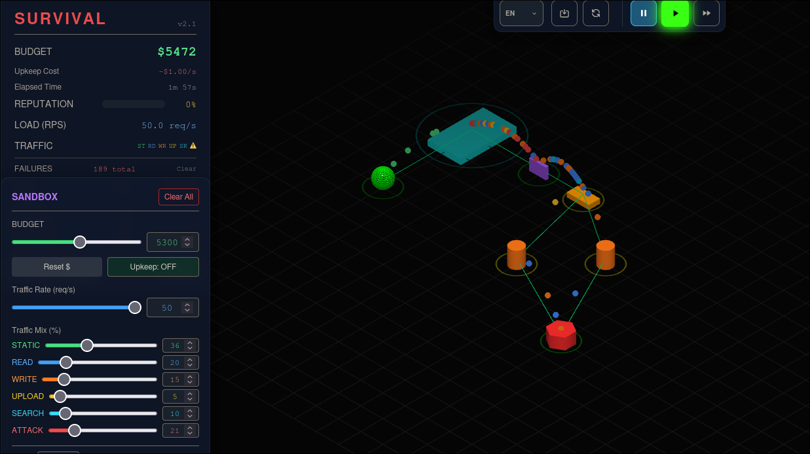

* **CDN** = $60
* **Firewall** = $40
* **Queue** = $45
* **Compute x2** = $60 x 2 = $120
* **SQL DB** = $150
* **Total** = **$415**

### Comportamiento y Salud de los Servicios
El estado de salud de los servicios siempre estuvo al máximo porque estamos en modo sandbox, pero lo que si notamos que fue cambiando fue el color del aro que tiene debajo que indica la saturación del servicio, si esta pudiendo procesar los paquetes que le llegan o si se esta congestionando, hasta que se llego a un overflow en los sistemas de cómputo

### Análisis de Falla
* **Momento de falla:** Ese fue el momento también donde la arquitectura empezó a fallar.

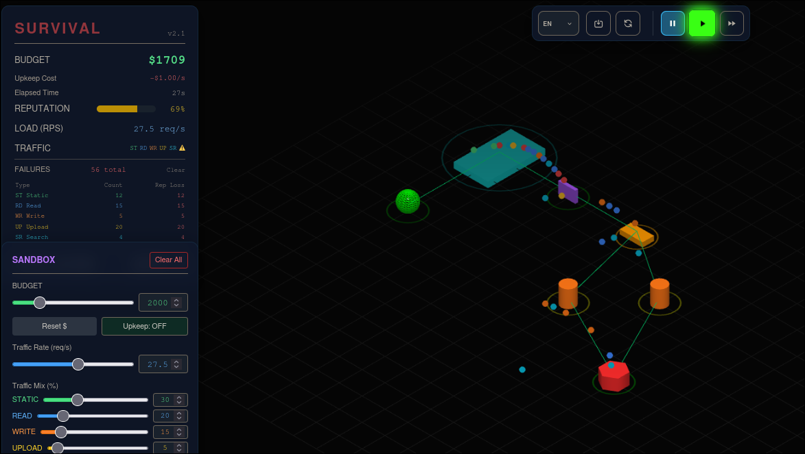

* **Qué componente falló primero?:** El primer componente en fallar fueron los servidores que el procesamiento de datos no dio abasto por la cantidad de paquetes, lo que hizo tambien que se congestionara la cola y la reputación comenzó a bajar en picada.

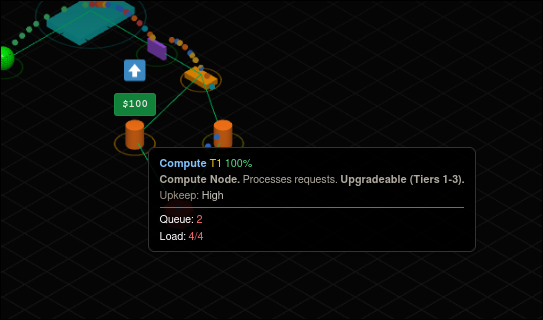

* **Por qué falló? (Capacidad, diseño, costo o seguridad):** Creemos que falló porque la cantidad de paquetes que le llegaron eran demasiados para la capacidad de cómputo de dos servidores, y sin balanceador de carga.

---

## 5) Escalabilidad y Balanceo
*Modificá la arquitectura del punto anterior para soportar mayor tráfico testeando estrategias de escalamiento.*

### Estrategia A: Añadir capacidad de cómputo (Horizontalmente, sin balanceador)
Lo primero que hicimos fue añadir más capacidad de cómputo (horizontalmente), esto hizo que la reputación no bajara de manera tan abrupta pero se mantenía/seguía bajando.
Y pudimos ver como habia servidores que estaban saturados y otros no

  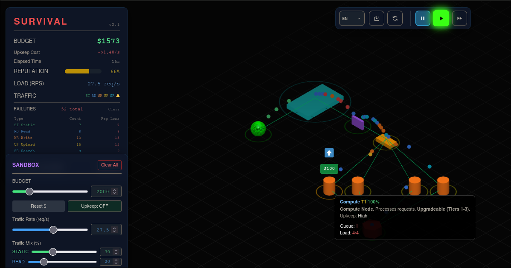
  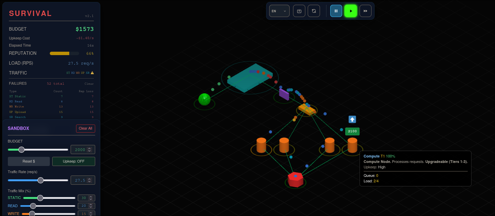

### Estrategia B: Incorporar Balanceador de Carga
Entonces añadimos un balanceador de carga
Esto hizo que se distribuyera la carga a los servidores de manera equitativa, ya que el balanceador de carga según la documentación utiliza round robin para distribuir la carga de forma equitativa.

  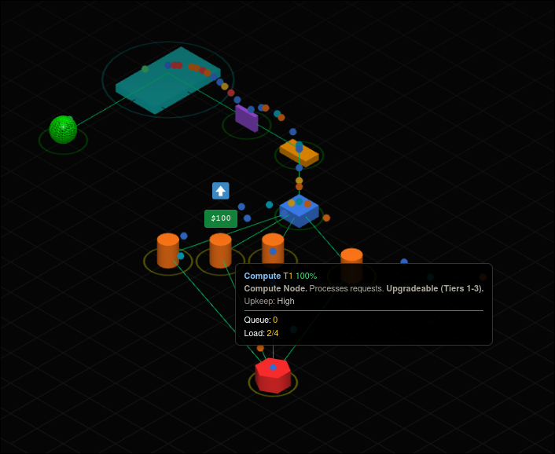
  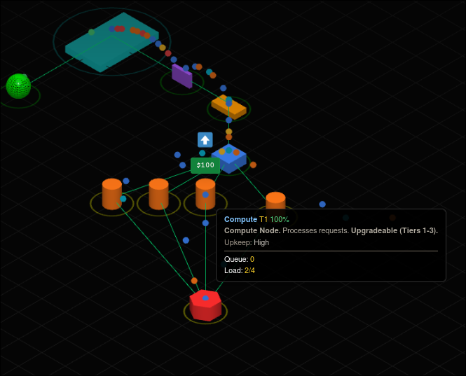
  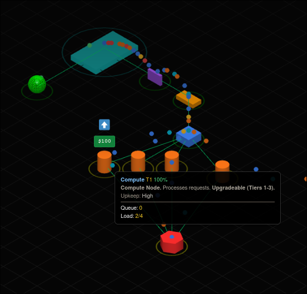

*La reputación seguia bajando aunque mas lentamente*

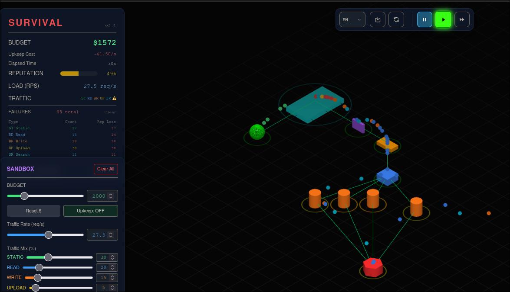

---

### Escalar horizontalmente siempre mejora el sistema?
*Para probarlo directamente en el simulador probamos duplicar la capacidad de computo escalando horizontalmente antes que escalar verticalmente.*

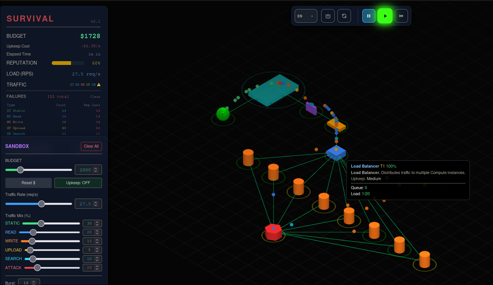

La reputación dejó de subir, comenzó a mantenerse, no subía ni bajaba, lo que significa que el sistema si mejoró su respuesta ante los paquetes, pero lo que aumentó notoriamente fue el `upkeep Cost`, ya que cada unidad de Cumpter tiene un alto costo de mantenimiento, pasando de $1.5 a $2.3.

Entonces ahora probamos con aumentar la capacidad de cómputo pero de manera vertical.

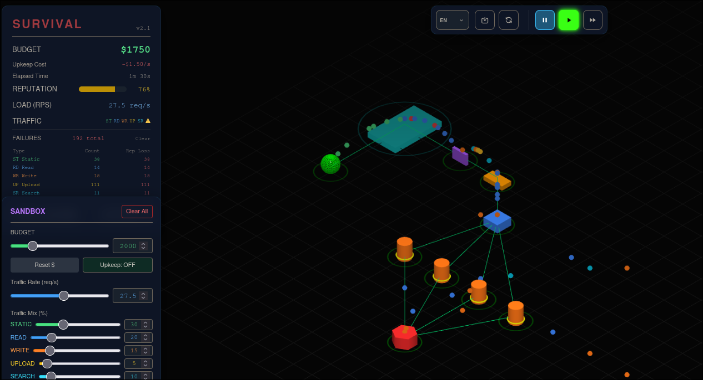

La reputación comenzó a subir, lentamente pero subía, lo que se traduce a que la capacidad de procesamiento de los paquetes aumentó, y el `upkeep Cost` se mantuvo en $1.5 ya que no aumentamos la cantidad de unidades de cómputo. Lo que sí es un factor a analizar es que el costo de agregar 4 unidades de cómputo era de $60x4 = $240 mientras que el de escalar verticalmente las 4 unidades fue de $100x4 = $400.

**Conclusión:**  
Entonces la respuesta según este caso es que escalar horizontalmente si mejora el sistema en términos de capacidad de procesamiento de datos, pero no significa que siempre sea favorable ya que podemos aumentar demasiado el costo de mantenimiento por tener esas unidades encendidas todo el tiempo, y hasta se puede dar el caso donde el tráfico sea muy bajo y el impacto del costo de mantenimiento sea mayor. Mientras que si escalamos verticalmente podemos alcanzar un mejor rendimiento al mismo costo de mantenimiento (aunque posiblemente, o al menos en el simulador, un mayor costo inicial de escalamiento).

---

### Siguiente Punto de Fallo: Base de Datos Relacional
El siguiente punto de fallo que tuvimos fue el de la base de datos relacional
Se llegó a un overflow que no permitió procesar más peticiones, principalmente como se puede ver en el panel de failures es el los paquetes de Read, ya que provocamos esto a propósito justamente subiendo el porcentaje de paquetes de lectura enviados.

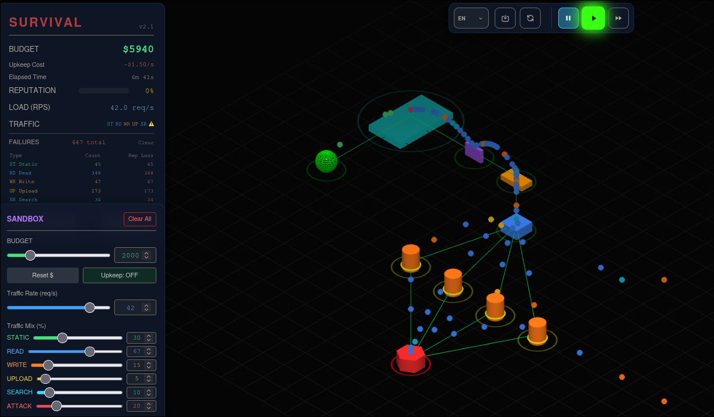

Frente a esto, probamos dos opciones:

#### Opción 1: Escalar verticalmente la base de datos
Primero escalamos verticalmente la base de datos
Para un `traffic rate` de `42 requests/segundo` y un porcentaje de peticiones de `84 de Read`, vemos como escalar la base de datos verticalmente hace que se comporte de manera aceptable manejando bien esa cantidad de flujo de paquetes.
Pero esto tiene una desventaja. Otro factor a considerar que favorece la decisión de es que el simulador presenta eventos que justamente simulan el comportamiento en la vida real, como puede ser la caída de un nodo/servicio, en este caso, vemos como si deja de funcionar la base de datos relacional nos quedamos sin poder procesar ninguna operación, aunque la base de datos esté en una escala vertical muy alta, por eso probamos la segunda opción, añadir réplicas de lectura (escalar horizontalmente) manteniendo la base de datos en nivel 1.

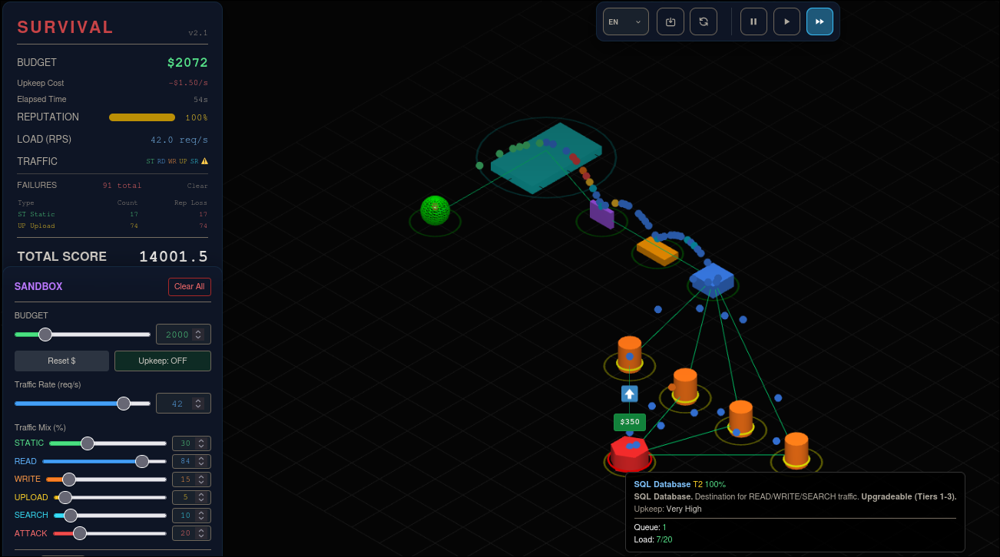

#### Opción 2: Añadir réplicas de lectura (Escalar horizontalmente)
Vemos como en este caso, puede ser más favorable escalar horizontalmente ya que para la misma cantidad de `traffic rate` y porcentaje de paquetes de lectura, mantenemos una buena respuesta y performance, el costo de mantenimiento si aumenta en $0.2 pero tenemos una gran ventaja la cual es tener un respaldo aunque sea para los paquetes de lectura, si se llegase a caer la base de datos original.

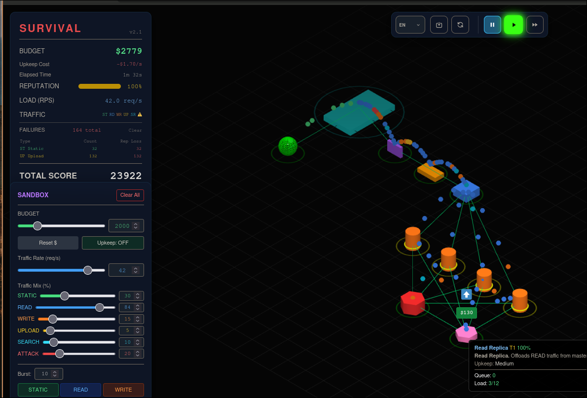

**Balance Horizontal vs. Vertical (Resumen)**
En resumen para este ejercicio del TP pudimos ver como lo ideal es buscar un equilibrio entre un escalado horizontal y vertical, ya ambos mejoran la performance del sistema en términos de procesamiento, pero si solo se escala horizontalmente podemos llegar a un coste de mantenimiento altísimo lo que no haría nada rentable al sistema, y si solo escalamos verticalmente concentramos demasiado los puntos de falla haciendo posible de que ante un evento inesperado como la caída de un nodo se nos caiga todo nuestro sistema.

---

## 6) Sobrevivir (Modo Survival)
*Diseñá una arquitectura inicial sólida y tratá de sobrevivir lo más posible mejorando la misma en el modo "survival".*

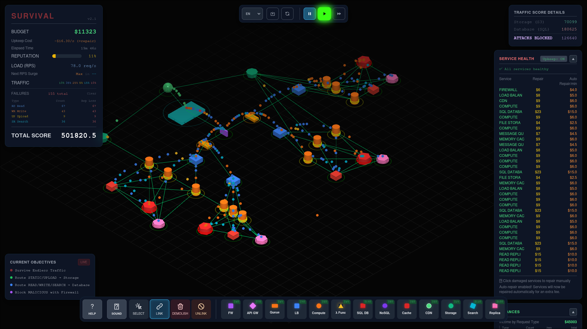

### Elección de Componentes y Tráfico Atendido
* **Firewall:** para filtrar los paquetes maliciosos e intentos de ataque. Atiende trafico **MALICIOUS** (rojo)
* **Compute (centros de cómputo):** Atiende todos los tráficos ya que pasan por el para ser procesados.
* **CDN:** para resolver los datos estáticos sin sobrecargar los sistemas propios - Atiende tráfico **STATIC** (verde)
* **Storage:** para ayudar al CDN con ese tipo de tráfico conectado a nuestros centros de cómputo, de manera que los estáticos necesarios se suban al storage y se mantengan ahí - Atiende tráfico **STATIC** (verde)
* **Queues:** para estabilizar el flujo de paquetes - Atiende todo tipo de paquetes
* **Load Balancer:** para distribuir equitativamente la carga sobre los centros de computos - Atiende todo tipo de paquetes
* **Base de datos relacional:** para almacenar los datos consistentemente- Cubre las request de **Read**(azul)/**Write**(naranja)/**Search**(celeste)
* **Réplica de base de datos:** para aliviar la carga de la BD relacional y tener un respaldo en caso de fallos en la BD - Cubre tráfico **Read**(verde)
* **Cache:** para aliviar la carga de las BD permitiendo que accedan a los datos mas recientes en la cache - Cubre las request de **Read**(azul)/**Write**(naranja)/**Search**(celeste)

### Cuellos de Botella y Escalado
El cuello de botella que apareció primero fue el del procesamiento, para eso escalamos horizontalmente un muy poco y luego verticalmente, pudiendo después seguir expandiendo.
El siguiente bottleneck fue el de la base de datos, primero escalamos verticalmente luego horizontalmente (aunque solo las de lectura) con las réplicas.

### Análisis del Punto de Fallo Final en Survival
Se dejo hasta ahí para ver el punto de fallo y fue el que se comentó anteriormente, se puede ver como la base de datos de arriba está fuera de servicio por el evento del juego, esto ocurrió anteriormente pero gracias a las réplicas de lectura no falló, pero al seguir avanzando se llegó a un punto donde el tráfico era muy elevado y al fallar la base de datos el sistema no pudo procesar muchos de paquetes, haciendo que se termine la simulación.

### Propuestas de Mejora y Redundancia
1. **Redundancia activa para la Base de Datos Relacional:**
   Lo que se podría hacer para evitar esto es añadir otra base de datos por cada nodos que armamos, de forma que al quedar inoperante una, la otra seguiría funcionando, y a diferencia de la réplica, otra base de datos relacional cubriría también los paquetes de Read y Search.
2. **Componentes dedicados adicionales:**
   Otra opción sería añadir componentes como motor de búsqueda (search) y base de datos no relacionales, que cubren también estos tipos de requests.

---

## Conclusión General del Trabajo Práctico
Como conclusión del trabajo, podemos decir que se aprendió las bases de funcionamiento de cada componente y que tipos de tráfico existen, se vieron cuáles son los primeros cuellos de botella que aparecen y cómo solucionarlos, lo que nos llevó a poder predecir puntos de falla y mejorar el criterio a la hora de tomar decisiones de escalamiento, todo esto nos permite tener una mejor visión como debería funcionar una arquitectura de red.
